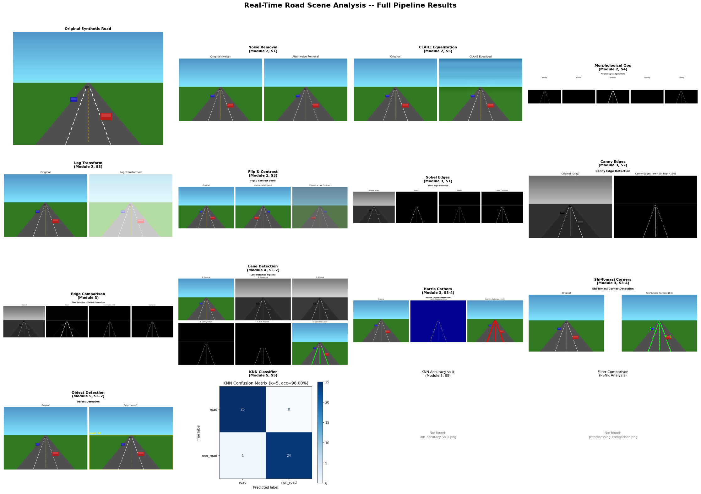

# 🚗 Road Scene Analysis System

### A classical Computer Vision pipeline for affordable road monitoring

> Built as part of the BYOP submission for the Computer Vision course
> VIT Bhopal | B.Tech CSE(AIML) | 2025–26

---

## 🔍 The Problem

Indian roads — particularly in Tier-2 cities like Bhopal, Indore, and Jabalpur — lack affordable, automated monitoring infrastructure. While metros like Bangalore and Delhi are slowly adopting smart traffic systems with AI-powered cameras, these deployments cost crores per intersection and depend on cloud GPU servers that are impractical to scale. Meanwhile, traffic authorities in smaller cities still rely on manual inspection: officers physically visiting roads to count vehicles, check lane markings, and file reports. This is slow, expensive, and fundamentally unable to keep up with the pace of urbanization.

Classical Computer Vision offers a practical middle ground. Unlike deep learning pipelines that demand NVIDIA GPUs and large labelled datasets, techniques like edge detection, Hough transforms, and KNN classifiers run comfortably on a ₹30,000 laptop CPU. The algorithms are mathematically interpretable — a traffic engineer can understand *why* the system detected a lane or flagged a corner, without needing to debug a neural network's hidden layers. This makes classical CV not just cheaper, but more trustable for government deployments where accountability matters.

This project — **Real-Time Road Scene Analysis System** — implements exactly this. It takes a road image or video frame and runs it through a 6-stage pipeline: noise removal and enhancement, edge detection, lane boundary extraction, corner and feature detection, vehicle/object detection, and region classification. Every stage produces measurable output (edge density scores, lane confidence values, corner counts, classification accuracy) so the results are quantifiable, not just visual. The entire system runs locally, produces a JSON metrics report, and can be explored through an interactive Streamlit dashboard — no internet connection or GPU required.

---

## 💡 The Solution

- **Preprocessing pipeline** that cleans noisy road camera footage using Gaussian, median, and bilateral filters with measurable PSNR improvement
- **Edge and lane detection** using Canny algorithm and Hough Line Transform to automatically identify road lane boundaries from raw images
- **Feature detection** using Harris, Shi-Tomasi, and FAST corner detectors to identify structurally significant points (road signs, vehicle corners, intersection markers)
- **Object detection and tracking** using MobileNet-SSD (with a contour-based fallback) and CSRT/KCF trackers for vehicle monitoring across video frames
- **KNN image classification** using HOG feature descriptors to classify road vs. non-road image patches with 98% accuracy on synthetic data

**Architecture in one line:** Input image → Preprocessing → Edge/Corner detection → Lane extraction → Object detection → KNN classification → Metrics JSON + Visualizations.

---

## 🗂️ Project Structure

```
road-scene-analysis/
├── app.py                     # Streamlit interactive dashboard
├── main.py                    # CLI entry point with synthetic demo
├── results_visualizer.py      # Generates composite 4×4 results grid
├── requirements.txt           # Pinned dependencies
├── README.md                  # This file
├── REPORT.md                  # Full BYOP project report
├── COMMIT_GUIDE.md            # Suggested git commit history
├── SUBMISSION_CHECKLIST.md    # Pre-submission verification checklist
│
├── modules/
│   ├── __init__.py            # Package init with re-exports
│   ├── preprocessing.py       # Noise removal, CLAHE, morphology, log transform
│   ├── edge_detection.py      # Sobel, Canny, Laplacian operators
│   ├── lane_detection.py      # Hough Transform based lane finder
│   ├── corner_detection.py    # Harris, Shi-Tomasi, FAST detectors
│   ├── object_detector.py     # MobileNet-SSD + contour fallback
│   ├── object_tracker.py      # CSRT / KCF video tracking
│   ├── classifier.py          # KNN classifier with HOG features
│   └── metrics.py             # Quantitative evaluation + JSON export
│
├── notebooks/
│   └── pipeline_demo.ipynb    # Lab-report style walkthrough with LaTeX
│
├── assets/                    # Place input images/videos here
│   ├── sample_images/
│   └── sample_video/
│
└── outputs/                   # Auto-generated results (16+ files)
    ├── synthetic_road.png
    ├── preprocessing_*.png
    ├── edge_*.png
    ├── lane_detection_pipeline.png
    ├── corners_*.png
    ├── detected_objects.png
    ├── knn_confusion_matrix.png
    ├── knn_accuracy_vs_k.png
    ├── metrics_report.json
    └── FULL_PIPELINE_RESULTS.png
```

---

## ⚙️ Setup & Installation

### Prerequisites

- Python 3.10 or higher
- pip

### Steps

```bash
git clone https://github.com/YOUR_USERNAME/road-scene-analysis.git
cd road-scene-analysis
pip install -r requirements.txt
```

### Run CLI

```bash
python main.py
# Select option 8 for the full synthetic pipeline demo
```

### Run Dashboard

```bash
streamlit run app.py
```

### Run Notebook

```bash
jupyter notebook notebooks/pipeline_demo.ipynb
```

### Generate Composite Results

```bash
python results_visualizer.py
# Creates outputs/FULL_PIPELINE_RESULTS.png
```

---

## ⚡ Quick Verification (For Evaluators)

To verify the project works without any setup beyond `pip install`:

```bash
# Step 1: Check environment
python setup_check.py

# Step 2: Run full pipeline demo (no dataset needed)
python demo.py

# Step 3: View all outputs
# Check the outputs/ folder — 14+ images + metrics_report.json
# Check outputs/FULL_PIPELINE_RESULTS.png for the complete grid

# Step 4: Launch interactive dashboard
streamlit run app.py
```

**Expected runtime:** under 60 seconds for `demo.py`  
**Tested on:** Windows 11, Python 3.12

---

## 🧪 Features & Course Coverage

| Feature | Technique | Course Module |
|---------|-----------|---------------|
| Noise Removal | Gaussian, Median, Bilateral Filter | Module 2 – Session 1 |
| Contrast Enhancement | Histogram Equalization (CLAHE) | Module 2 – Session 5 |
| Morphological Cleanup | Erosion, Dilation, Opening, Closing | Module 2 – Session 4 |
| Intensity Mapping | Log & Power Law Transformation | Module 2 – Session 3 |
| Edge Detection | Sobel Operator | Module 3 – Session 1 |
| Edge Detection | Canny Algorithm | Module 3 – Session 2 |
| Lane Detection | Hough Line Transform | Module 3 – Session 5 & 6 |
| Corner Detection | Harris, Shi-Tomasi | Module 3 – Session 3 & 4 |
| Object Detection | MobileNet-SSD via OpenCV DNN | Module 5 – Session 4 |
| Object Tracking | CSRT Tracker | Module 5 – Session 5 |
| Classification | KNN Classifier | Module 5 – Session 2 |

Each module also includes a `compare_parameters()` function that benchmarks alternative algorithms side-by-side with quantitative metrics (PSNR, edge density, keypoint count, detection time).

---

## 📊 Sample Results

> Run `python results_visualizer.py` to generate this composite image.



**Row 1:** Original synthetic road → Noise removal (Gaussian + Median) → CLAHE contrast enhancement → Morphological operations (erosion, dilation, opening, closing)

**Row 2:** Log transformation → Flip & contrast demo → Sobel edge detection (X, Y, combined gradients) → Canny edge detection (threshold 50/150)

**Row 3:** Edge method comparison (Sobel vs Canny vs Laplacian) → Lane detection pipeline (6-step: gray → blur → Canny → ROI → Hough → overlay) → Harris corner detection (response map + corner overlay) → Shi-Tomasi corners (100 best features)

**Row 4:** Object detection (contour fallback) → KNN confusion matrix (98% accuracy) → KNN accuracy vs k plot → Filter comparison (PSNR analysis)

---

## ⚠️ Limitations

- **Low-light and weather:** The pipeline has not been tested on rainy, foggy, or nighttime road images. CLAHE helps with contrast but cannot recover information lost to sensor noise in near-darkness.
- **Curved roads:** The Hough Line Transform detects straight lines only. Roads with sharp bends or roundabouts produce false positives or missed detections.
- **KNN generalization:** The classifier is trained on synthetic data. Real-world accuracy depends on retraining with actual road image patches from Indian road datasets.
- **Object detection scope:** The MobileNet-SSD model was not fine-tuned on Indian road conditions — autorickshaws, bullock carts, and two-wheelers may not be reliably detected.
- **Single-frame analysis:** Currently processes one frame at a time. Temporal consistency across video frames (e.g., tracking lane drift over time) is not implemented.

---

## 🔭 Future Work

- **Deep learning upgrade:** Replace KNN with a fine-tuned CNN (EfficientNet / ResNet) trained on BDD100K or Indian Driving Dataset for multi-class road classification.
- **Pothole detection module:** Add a texture analysis pipeline using Gabor filters and morphological segmentation to detect potholes from road surface images.
- **Edge deployment:** Package the pipeline as a lightweight executable for Raspberry Pi 4 + USB camera, enabling sub-₹5000 road monitoring stations.
- **CCTV integration:** Add RTSP stream ingestion so the system can process live feeds from existing municipal traffic cameras.
- **Curved lane detection:** Implement sliding window + polynomial fitting for curved road lane detection.

---

## 🙋 Author

| | |
|---|---|
| **Name** | Gaurav Sharma |
| **Roll No** | 23BAI10554 |
| **Program** | B.Tech CSE(AIML), VIT Bhopal |
| **Course** | Computer Vision (BYOP Project) |
| **Academic Year** | 2025–26 |
